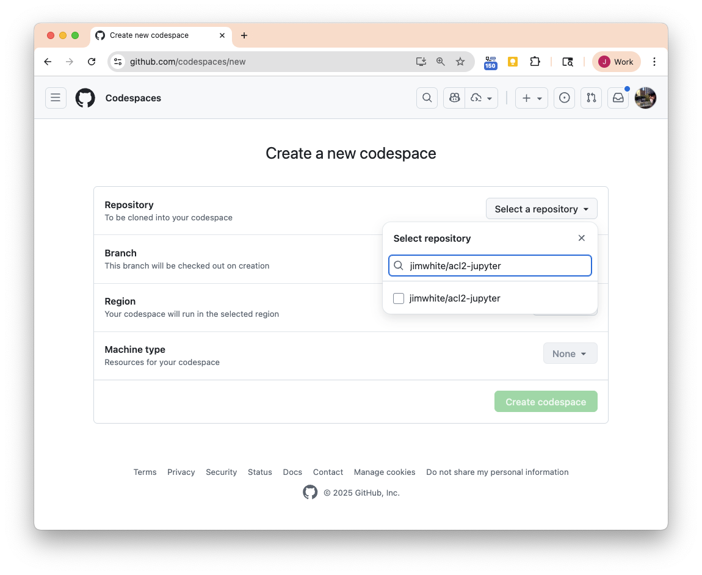
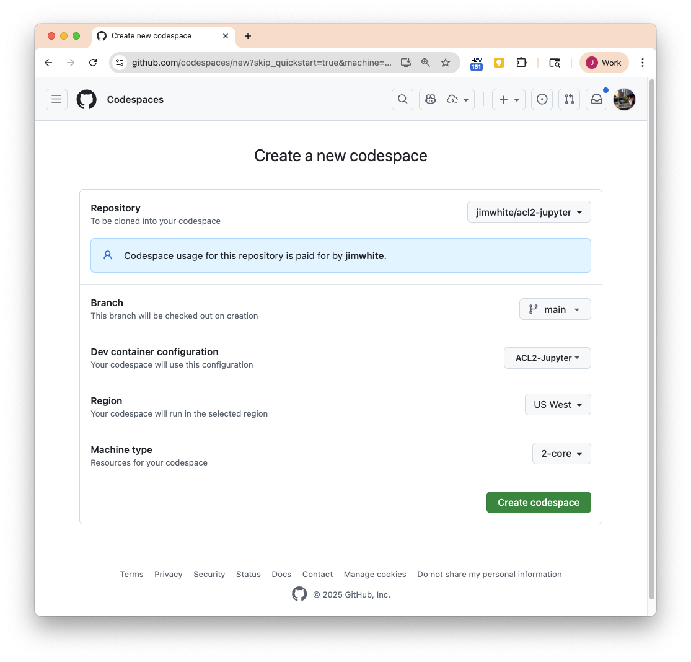
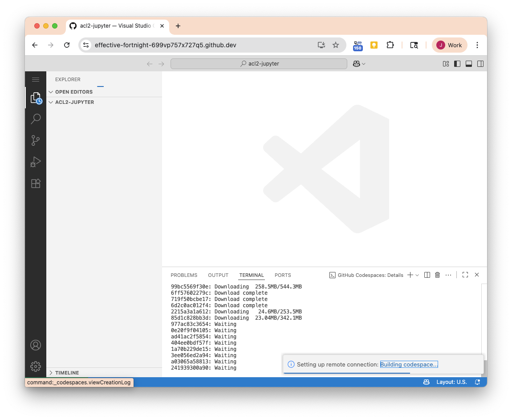
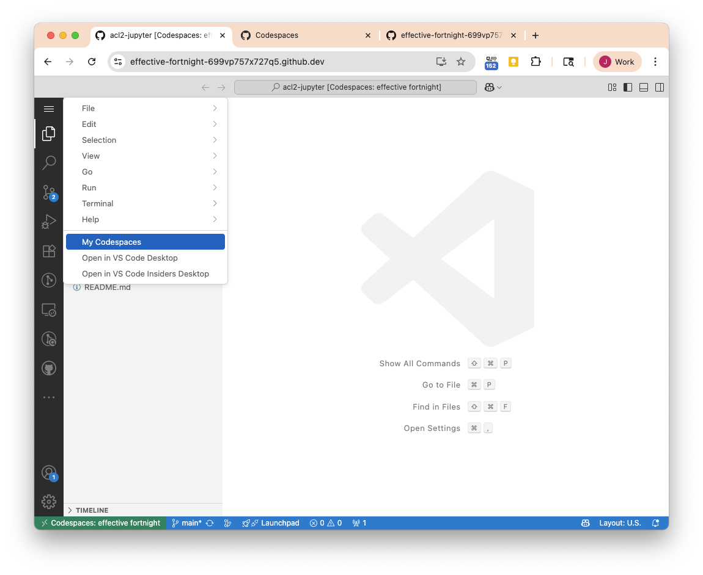
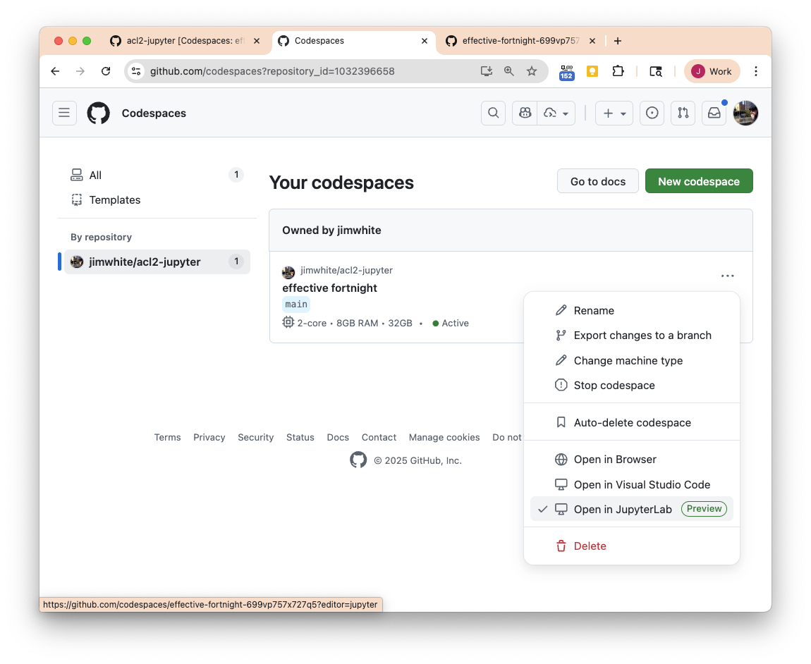
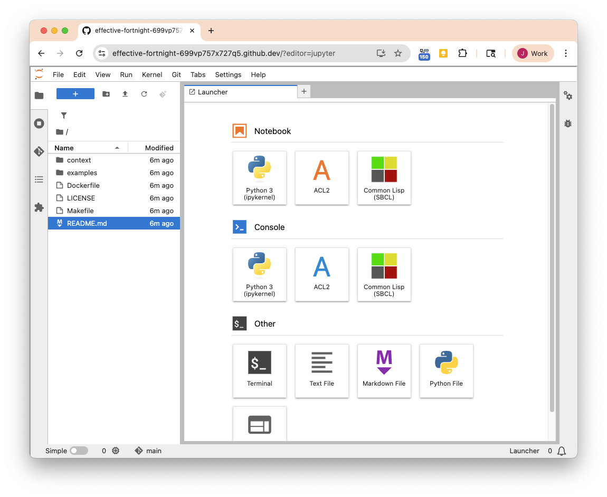

# ACL2-Jupyter Docker Image

Use *A Computational Logic for Applicative Common Lisp (ACL2)* in Jupyter notebooks running in a container with just a command or two. 

## Availability

This image is available on the GitHub Container Registry at [`jimwhite/acl2-jupyter`](https://ghcr.io/jimwhite/acl2-jupyter).

The project source is at https://github.com/jimwhite/acl2-jupyter.

## Examples

* https://github.com/jimwhite/acl2-notebooks - a few example notebooks
* https://github.com/jimwhite/acl2-swf-experiments forked from [Mike Dodd's ACL2/Claude Code experiment](https://github.com/septract/acl2-swf-experiments).
* https://github.com/jimwhite/agent-client-kernel - extending ACL2-Jupyter with Zed's Agent Client Protocol for coding agent integration

## Moar Information

* *ACL2* home page at UT Austin https://www.cs.utexas.edu/~moore/acl2/acl2-doc.html
* *ACL2 GitHub project* https://github.com/acl2/acl2
* *Hyper-Card for ACL2 Programming* https://www.cs.utexas.edu/~moore/publications/hyper-card.html
* *ACL2 versions of (some of) the Top 100 Theorems List* https://acl2.org/doc/?topic=ACL2____100-THEOREMS
* *ACL2 Documentation* https://acl2.org/doc
* *ACL2 Community* https://acl2.org/doc/?topic=ACL2____COMMUNITY
* *ACL2 Workshops*  https://acl2.org/doc/?topic=ACL2____WORKSHOPS
* *An ACL2(s) Interface to Z3* by Walter and Manolios, ACL2 2025 https://cgi.cse.unsw.edu.au/~eptcs/paper.cgi?ACL2in2025.10
* *Advances in ACL2 Proof Debugging Tools* by Kaufman and Moore, ACL2 2023 https://cgi.cse.unsw.edu.au/~eptcs/paper.cgi?ACL22023.7
* *Using ACL2 To Teach Students About Software Testing* by Gamboa and Thoney ACL2 2022 https://arxiv.org/abs/2205.11695
* *ACL2(ml): Machine-Learning for ACL2* by Heras and Komendantskaya ACL2 2014 https://arxiv.org/abs/1404.3034
* https://github.com/s-expressionists - active community developing kewl new CL packages

## Credits
This project is built from:

* https://github.com/mister-walter/acl2-docker by [Andrew Walter](https://www.atwalter.com/)
* https://github.com/yitzchak/common-lisp-jupyter along with several other repos by [Tarn Burton](https://github.com/yitzchak)
* https://github.com/jimwhite/acl2-kernel forked from https://github.com/tani/acl2-kernel by [Masaya Taniguchi](https://tani.cc/).
* https://github.com/rubengamboa/acl2-docker-images by [Ruben Gamoa](https://www.uwyo.edu/eecs/faculty-staff/faculty/ruben-gamboa/index.html)

## Using a prebuilt image locally

By default, running this Docker image will launch the JupyterLab server on port `8888`.  JupyterLab will open with `/home/jovyan/work` as the current dir.  The `-v $(PWD):/home/jovyan/work` arg maps your current dir to share files so your notebooks persistent.

```bash
docker run -it --rm -p 8888:8888 -v $(PWD):/home/jovyan/work ghcr.io/jimwhite/acl2-jupyter:latest
```

When that starts up (which will can take a few minutes the first time; the image is about 6GB) you should then see the stdout which will end with the URL to open in your browser:
```
Entered start.sh with args: start-notebook.py
Running hooks in: /usr/local/bin/start-notebook.d as uid: 1000 gid: 100
...
[C 2025-10-27 18:47:01.032 ServerApp] 
    
    To access the server, open this file in a browser:
        file:///home/jovyan/.local/share/jupyter/runtime/jpserver-7-open.html
    Or copy and paste one of these URLs:
        http://localhost:8888/lab?token=89af207743181314d392f106d1a7b1c80e1738b92ebf03ee
        http://127.0.0.1:8888/lab?token=89af207743181314d392f106d1a7b1c80e1738b92ebf03ee
```

An alternative way to run without file sharing is to make the container persistent by omitting the `--rm` arg.  You can use JupyterLab's upload/download commands to share files.

```bash
docker run -it --name my-acl2-jupyter -p 8888:8888 ghcr.io/jimwhite/acl2-jupyter:latest
```

To get the CLI just supply the command.  For SBCL and ACL2 in a terminal you'll want `rlwrap`.

```bash
docker run -it --rm -v $(PWD):/home/jovyan/work ghcr.io/jimwhite/acl2-jupyter:latest rlwrap acl2
```
```
Entered start.sh with args: rlwrap acl2
Running hooks in: /usr/local/bin/start-notebook.d as uid: 1000 gid: 100
Done running hooks in: /usr/local/bin/start-notebook.d
Running hooks in: /usr/local/bin/before-notebook.d as uid: 1000 gid: 100
Sourcing shell script: /usr/local/bin/before-notebook.d/10activate-conda-env.sh
Done running hooks in: /usr/local/bin/before-notebook.d
Executing the command: rlwrap acl2
This is SBCL 2.5.9, an implementation of ANSI Common Lisp.
More information about SBCL is available at <http://www.sbcl.org/>.

SBCL is free software, provided as is, with absolutely no warranty.
It is mostly in the public domain; some portions are provided under
BSD-style licenses.  See the CREDITS and COPYING files in the
distribution for more information.

 ++++++++++++++++++++++++++++++++++++++++++++++++++++++++++++++++++++++++
 + ACL2 Version 8.6+ (a development snapshot based on ACL2 Version 8.6) +
 +   built October 26, 2025  03:26:12.                                  +
 +   (Note from the environment when this executable was saved:         +
 +    Git commit hash: f616797704e17ffce6a0d5e38fc09713bad26572)        +
 + Copyright (C) 2025, Regents of the University of Texas.              +
 + ACL2 comes with ABSOLUTELY NO WARRANTY.  This is free software and   +
 + you are welcome to redistribute it under certain conditions.  For    +
 + details, see the LICENSE file distributed with ACL2.                 +
 ++++++++++++++++++++++++++++++++++++++++++++++++++++++++++++++++++++++++

Project-dir-alist:
((:SYSTEM . "/home/acl2/books/")).
Type :help for help.
Type (quit) to quit completely out of ACL2.

ACL2 !>(* 1 2 3 4 5)
120
ACL2 !>
```

### Passwordless `sudo`
Using `sudo` within the container does not require a password.

### Using a specific ACL2 version
You can replace `latest` with an ACL2 release tag in the commands above.  The most recent ACL2 release is `8.6`.  For example:

```bash
docker run -it --rm -p 8888:8888 -v $(PWD):/home/jovyan/work ghcr.io/jimwhite/acl2-jupyter:8.6
```

## Using a prebuilt image in a GitHub Codespace (free!)

There is a [devcontainer.json](https://github.com/jimwhite/acl2-jupyter/blob/main/.devcontainer/devcontainer.json) file in the [repo](https://github.com/jimwhite/acl2-jupyter) so use the "New codespace" action in the "+" dropdown (middle of the buttons at top right of the repo page) then enter "jimwhite/acl2-jupyter" for "Select repository".  The smallest machine type is 2 CPUs which is plenty.

<div style="display: flex; align-items: center;">
  
  
</div>
<div style="display: flex; align-items: center;">
  
  
</div>

It takes a few minutes to build the codespace because the image is fairly large (~10GB).  After it loads there may be some messages about various extensions loading or not and such but they can (probably) be ignored.  Choose "My codespaces" from the top left menu icon, then select the codespace for the "jimwhite/acl2-jupyter" repo, click "Show more actions for this codespace" (... menu at the right), and choose "Open in JupyterLab".

<div style="display: flex; align-items: center;">


</div>

And success!



The Free Tier on GitHub gets 120 CPU hours free: https://docs.github.com/en/billing/concepts/product-billing/github-codespaces.  The small dual CPU is $0.18 per hour after the free allocation.

But GitHub recently deployed budgets for all billed services with $0 allocation by default; so if you get a "Billing Error" message, go to your billing settings and set appropriate quotas.

## Old Usage

By default, running this Docker image will run the JupyterLab service. The "basic" selection of books (per the ACL2 Makefile) has been certified, but you may want to certify additional books. One way to do this is to start a Docker container with a shell rather than ACL2; one can do that with a command like `docker run -it ghcr.io/jimwhite/acl2-jupyter:latest /bin/bash`. Then, one can use [cert.pl](https://www.cs.utexas.edu/~moore/acl2/manuals/current/manual/?topic=BUILD____CERT.PL) to certify some books before starting ACL2. A full example is shown below, where lines prefixed by `$` indicate commands executed outside of Docker and `#` indicate commands executed inside of the Docker container.

```
$ docker run -it ghcr.io/jimwhite/acl2-jupyter:latest /bin/bash
# cert.pl ~/acl2/books/sorting/isort
# acl2
# ACL2 !> (include-book "sorting/isort" :dir :system)
# ACL2 !> (isort '(5 2 1 4 3))
(1 2 3 4 5)
```

Note that when the Docker container exits, the certificates for any books certified since the container was started will be lost. If you find yourself repeatedly needing to certify the same set of books, you can create a new Docker image based on this one. You can find an example Dockerfile in `examples/certified-books/Dockerfile`.

Also note that you can run `cert.pl` in a JupyterLab terminal.

## Building

The [`jq`](https://github.com/stedolan/jq) command-line tool must be installed to use the provided `Makefile` to build an ACL2 Docker image. This tool is used to get the latest commit hash for the ACL2 repo from Github.

So `which jq` and then `brew install jq` or `sudo apt-get install jq` as appropriate if not already installed.

This project uses several submodules from https://github.com/yitzchak. Either use `git clone --recurse-submodules` or run `make git-submodules` to sync those files.

```bash
git clone https://github.com/jimwhite/acl2-jupyter.git
cd acl2-jupyter
make git-submodules
make
make run
```

The `make run` will run sharing the CWD as above (`docker run -it -p 8888:8888 -v $(PWD):/home/jovyan/work acl2-jupyter`).

To enable reproducible builds and reduce image size, image build time, and download bandwidth during a build, the Dockerfile expects that it is provided a `ACL2_REPO_LATEST_COMMIT` build argument. This argument must be set to a URL-safe string corresponding to a commit or tag format that Github understands. I have tested this with full commit hashes and short commit hashes (e.g. the first 8 characters of the full commit hash). As suggested above, the `build` make target will  use Github's API to determine the commit hash for the latest commit to the ACL2 repo and pass that to Docker when building an image.

### Multi-Platform Building

This image is distributed as a multi-platform Docker image with both `linux/amd64` and `linux/arm64` versions available. Docker will automatically use the appropriate version for your computer's architecture.

As of the latest update, both architectures are now built automatically using GitHub Actions with native runners:

- **amd64 images**: Built on standard `ubuntu-latest` runners
- **arm64 images**: Built on a self-hosted M-series Mac (Apple Silicon/ARM64)

This approach avoids the limitations of QEMU emulation, which doesn't support the full FPU exception handling required by ACL2.  We also can't use GitHub hosted ARM64 runners because they don't handle FP traps the way SBCL expects.

#### Building Locally

You can still build images locally if needed. The Makefile supports building for your native architecture:

```bash
# Build for your native architecture
make build IMAGE_VERSION=your-tag

# For GitHub Container Registry
make build-ghcr IMAGE_VERSION=your-tag
```

For multiarch builds, you would need a Docker builder with multiple native nodes.

### Package builds via GitHub Actions

This repository includes a GitHub Actions workflow that automatically builds and publishes multiarch Docker images to the GitHub Container Registry (ghcr.io). The workflow is triggered by:

- **Release publications**: When a new release/tag is published, the image is built and tagged with the release version
- **Pushes to main**: When changes to the Dockerfile, context files, or the workflow itself are pushed to the main branch
- **Manual trigger**: The workflow can be manually triggered from the Actions tab with a custom tag

The workflow automatically:
- Builds for both `linux/amd64` and `linux/arm64` platforms using native runners
- Uses self-hosted runner for ARM64 builds (no QEMU emulation)
- Retrieves the latest ACL2 commit hash from the upstream repository for "latest" tag or a given ACL2 release tag (e.g. 8.6).
- Authenticates with ghcr.io using GitHub's built-in `GITHUB_TOKEN`
- Uses GitHub Actions cache to speed up subsequent builds (separate caches per architecture)
- Creates a multiarch manifest combining both platform images
- Tags images appropriately (latest, version tags, semver patterns)

The build process consists of three jobs:
1. **Prepare**: Gets ACL2 commit hash and determines image tags
2. **Build AMD64/ARM64**: Parallel builds on native runners for each platform
3. **Create Manifest**: Combines both platform images into a multiarch manifest

To manually trigger a build, go to the Actions tab, select "Build and Push Docker Image to GHCR", configure the acl2_tag (default "latest"), and click "Run workflow".

## Notes

By default, certification is done with 4 parallel tasks. This can be changed by overriding the `ACL2_CERT_JOBS` variable of the Makefile. For example, to use 2 tasks instead, run `make build ACL2_CERT_JOBS=2`.

To provide additional arguments to the `make` command that will be used to build ACL2's books, you can override the `ACL2_CERTIFY_OPTS` variable of the Makefile. Notice that this will override the effects of the `ACL2_CERT_JOBS` variable, so you will need to provide the appropriate `-j` option in that case.

By default, the "basic" book selection is certified. This can be changed by overriding the `ACL2_CERTIFY_TARGETS` build argument. Multiple targets can be provided to this argument if desired.

## Sources

```bash
# sha256 of quicklisp.lisp = 4a7a5c2aebe0716417047854267397e24a44d0cce096127411e9ce9ccfeb2c17
wget -kL -P context https://beta.quicklisp.org/quicklisp.lisp

git submodule add https://github.com/jimwhite/acl2-kernel.git context/acl2-kernel
git submodule add https://github.com/yitzchak/archlinux-cl.git context/archlinux-cl
git submodule add https://github.com/yitzchak/common-lisp-jupyter.git context/quicklisp/local-projects/common-lisp-jupyter
git submodule add https://github.com/yitzchak/delta-vega.git context/quicklisp/local-projects/delta-vega
git submodule add https://github.com/yitzchak/resizable-box-clj.git context/quicklisp/local-projects/resizable-box-clj
git submodule add https://github.com/yitzchak/ngl-clj.git context/quicklisp/local-projects/ngl-clj
```

* https://github.com/jimwhite/acl2-kernel.git context/acl2-kernel is forked from https://github.com/tani/acl2-kernel to bring it up-to-date.

* https://github.com/jimwhite/acl2-jupyter itself is forked from https://github.com/mister-walter/acl2-docker (and was unforked due to a GitHub permissions confusion and can't be undone).

### Base Image

ACL2-Jupyter uses the [quay.io/jupyter/minimal-notebook:latest](https://quay.io/repository/jupyter/minimal-notebook) image (source https://github.com/jupyter/docker-stacks/tree/main/images/minimal-notebook) because we want the JupyterLab stuff to work and we're gonna build SBCL and ACL2 the way we want anyhow.  Note that the DockerHub image is no longer updated.

For a full complement of Python support including PySpark use BASE_IMAGE=[quay.io/jupyter/pyspark-notebook:latest](https://quay.io/repository/jupyter/pyspark-notebook) image (source https://github.com/jupyter/docker-stacks/tree/main/images/pyspark-notebook)
